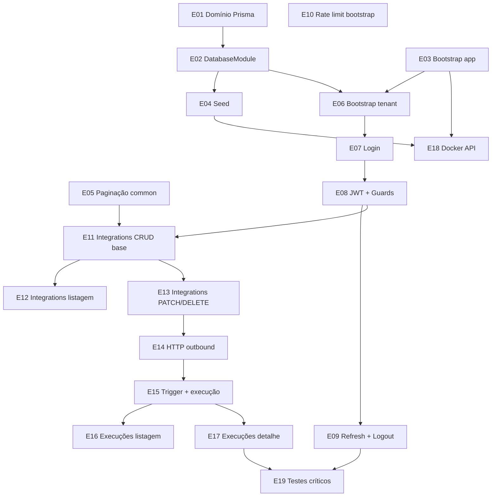

# Plano de Entregas — Backend Commandix PoC

> **Objetivo:** implementar o backend em slices pequenos, cada um entregando valor testável com diff mínimo.  
> **Fonte de verdade:** [`AGENTS.md`](../../AGENTS.md), [`docs/spec/`](../spec/README.md), checklist [`11-checklist.md`](../spec/11-checklist.md).

---

## Princípios de entrega

1. **Uma entrega = um PR/revisão** — evitar mega-commits que misturam domínio, auth e integrações.
2. **Backend first** — ordem: fundação → auth → integrações → execuções → infra Docker → testes críticos.
3. **Testável ao final de cada slice** — curl, Vitest ou ambos; não avançar sem critério de done atendido.
4. **Escopo mínimo** — só o que a spec pede; sem módulo `users/`, sem features bônus.
5. **Multi-tenancy desde o primeiro service de negócio** — `tenantId` do JWT, nunca do body.
6. **Imports** — alias `@/` → `src/`; sufixo `.js` (ver `AGENTS.md` § Convenções).

---

## Estado atual (baseline)

| Item | Status |
|------|--------|
| NestJS 12 starter | ✅ |
| Global prefix `api/v1` | ✅ (`main.ts`) |
| Prisma 8 — domínio Commandix | ✅ (`contract.prisma` + migration `initial`) |
| Seed idempotente | ✅ (`src/prisma/seed.ts`) |
| `GET /api/v1/health` | ✅ |
| Módulos de negócio | ❌ |
| `DatabaseModule` | ✅ |
| `ValidationPipe` / CORS | ✅ |
| Docker Compose | ⚠️ postgres + api (frontend pendente) |
| Testes críticos | ❌ |

---

## Mapa de dependências



---

## Entregas

### E09 — Refresh + logout

**Objetivo:** ciclo completo de sessão.

**Escopo:**
- `POST /auth/refresh` — body `{ refreshToken }` → `{ accessToken }`
- Validar hash, `expiresAt`, `revokedAt === null`
- Token inválido/expirado/revogado → `401`
- `POST /auth/logout` — JWT required; body `{ refreshToken }` → `204`
- Revoga **somente** o refresh enviado; idempotente (inexistente/já revogado → `204`)
- Refresh exp `7d` via `JWT_REFRESH_SECRET` / `JWT_REFRESH_EXPIRES_IN`

**Arquivos:**
- Modificar: `auth.controller.ts`, `auth.service.ts`
- Criar: `dto/refresh.dto.ts`, `dto/logout.dto.ts`

**Critério de done:**
- [ ] Refresh emite novo access
- [ ] Logout revoga refresh; segundo refresh falha
- [ ] Outro refresh token do mesmo user continua válido

**Dependências:** E08

---

### E10 — Rate limit no bootstrap

**Objetivo:** proteção básica em `POST /tenants/bootstrap`.

**Escopo:**
- `@nestjs/throttler` — **somente** na rota bootstrap
- Default: 5 req / 60s por IP
- Env: `BOOTSTRAP_THROTTLE_TTL`, `BOOTSTRAP_THROTTLE_LIMIT`
- Excesso → `429`

**Arquivos:**
- Modificar: `tenants.controller.ts`, `tenants.module.ts` ou `app.module.ts`

**Critério de done:**
- [ ] 6ª requisição bootstrap no mesmo IP/minuto → 429
- [ ] Login e demais rotas **não** afetados

**Dependências:** E06

---

### E11 — Integrations: criar + detalhe

**Objetivo:** primeiras rotas de integração com tenant scoping.

**Escopo:**
- Módulo `integrations/`
- `POST /integrations` — ADMIN; persiste com `tenantId` do JWT
- `GET /integrations/:id` — ADMIN, VIEWER; filtro `{ id, tenantId }`; cross-tenant → 404
- DTOs create conforme [05-api §5.3](../spec/05-api.md#post-integrations)
- Resposta com `authKey` mascarada (E05)
- Campos JSON opcionais: `customHeaders`, `defaultPayload`

**Arquivos:**
- Criar: `src/integrations/integrations.module.ts`, `integrations.controller.ts`, `integrations.service.ts`, `dto/create-integration.dto.ts`

**Critério de done:**
- [ ] Admin cria integração; viewer consegue ler
- [ ] ID de outro tenant → 404
- [ ] Viewer em POST → 403

**Dependências:** E08, E05

---

### E12 — Integrations: listagem paginada

**Objetivo:** listar integrações do tenant com paginação e filtro.

**Escopo:**
- `GET /integrations` — ADMIN, VIEWER
- Paginação E05; filtro opcional `isActive` (true/false/omitido = todas)
- Ordenação fixa: `updatedAt DESC`
- Listagem **resumida** — sem `customHeaders` / `defaultPayload` completos
- Envelope `{ data, meta }`

**Arquivos:**
- Modificar: `integrations.controller.ts`, `integrations.service.ts`
- Criar: `dto/list-integrations-query.dto.ts`

**Critério de done:**
- [ ] `page`, `limit`, `isActive` validados (400 se inválido)
- [ ] Meta coerente; página além do fim → 200 com `data: []`

**Dependências:** E11

---

### E13 — Integrations: PATCH + DELETE

**Objetivo:** atualização parcial e remoção com cascade.

**Escopo:**
- `PATCH /integrations/:id` — ADMIN; parcial conforme [05-api §5.3](../spec/05-api.md#patch-integrationsid)
  - `authKey` omitido → mantém anterior
  - `customHeaders` / `defaultPayload` enviados → substituem inteiro
  - Body `{}` → 400
- `DELETE /integrations/:id` — ADMIN; hard delete + cascade execuções (FK no contract)
- Cross-tenant → 404

**Arquivos:**
- Modificar: `integrations.controller.ts`, `integrations.service.ts`
- Criar: `dto/update-integration.dto.ts`

**Critério de done:**
- [ ] PATCH `{ isActive: false }` desativa
- [ ] DELETE remove integração e execuções associadas
- [ ] PATCH sem campos → 400

**Dependências:** E11

---

### E14 — Serviço HTTP outbound

**Objetivo:** cliente isolado para disparos externos (sem lógica de domínio).

**Escopo:**
- `src/integrations/http-outbound.service.ts` (ou `src/common/http/`)
- Sempre **POST**; timeout `HTTP_TRIGGER_TIMEOUT_MS` (default 30s)
- Headers: `customHeaders` primeiro; `Authorization: Bearer {authKey}` sobrescreve se ambos existirem
- Retorno tipado: `{ httpStatusCode: number | null, responseBody: string, responseTimeMs: number }`
- Timeout/rede → `httpStatusCode: null`

**Arquivos:**
- Criar: `http-outbound.service.ts`
- Teste unitário com mock fetch/undici

**Critério de done:**
- [ ] 2xx, 4xx, timeout simulado retornam estrutura esperada
- [ ] Sem retry

**Dependências:** nenhuma de negócio (pode ser paralelo a E11–E13)

---

### E15 — Trigger + registro de execução

**Objetivo:** disparo manual e persistência de `IntegrationExecution`.

**Escopo:**
- `POST /integrations/:id/trigger` — ADMIN
- Rejeitar se `isActive === false`
- Merge shallow: `{ ...defaultPayload, ...payload }`
- Chamar E14; determinar status: 2xx → `SUCCESS`, senão → `FAILURE`
- Truncar `responseBody` em 10 240 bytes UTF-8 + sufixo `… [truncated]`
- Persistir execução; resposta `200` conforme spec

**Arquivos:**
- Modificar: `integrations.controller.ts`, `integrations.service.ts`
- Criar: `dto/trigger-integration.dto.ts`, `utils/truncate-response-body.util.ts`

**Critério de done:**
- [ ] Trigger em integração inativa → erro (400 ou 404 conforme spec/implementação)
- [ ] Execução gravada com status correto
- [ ] Body > 10 KB truncado na persistência

**Dependências:** E13, E14

---

### E16 — Execuções: listagem por integração

**Objetivo:** histórico paginado com filtros.

**Escopo:**
- Módulo `executions/` (ou rotas em `integrations/` + service dedicado)
- `GET /integrations/:id/executions` — ADMIN, VIEWER
- Validar integração pertence ao tenant (404 cross-tenant)
- Paginação E05; filtros: `status`, `from`, `to` ([05-api §5.4](../spec/05-api.md#filtros-de-data-from-to))
- Parse ISO 8601; date-only `YYYY-MM-DD` → dia UTC inteiro; `from > to` → 400
- Ordenação: `executedAt DESC`
- Listagem **sem** `requestPayload` / `responseBody` completos (resumo)

**Arquivos:**
- Criar: `src/executions/executions.module.ts`, `executions.controller.ts`, `executions.service.ts`, `dto/list-executions-query.dto.ts`, `utils/parse-date-filter.util.ts`

**Critério de done:**
- [ ] Filtros de data inclusive funcionam em UTC
- [ ] Integração de outro tenant → 404

**Dependências:** E15

---

### E17 — Execuções: detalhe

**Objetivo:** detalhe de execução com tenant via join.

**Escopo:**
- `GET /executions/:id` — ADMIN, VIEWER
- Buscar execução + validar `integration.tenantId === user.tenantId`
- Cross-tenant → 404
- Resposta completa com `requestPayload` e `responseBody` (já truncado no banco)

**Arquivos:**
- Modificar: `executions.controller.ts`, `executions.service.ts`

**Critério de done:**
- [ ] Detalhe retorna campos completos
- [ ] Execução de outro tenant → 404

**Dependências:** E16

---

### E19 — Testes críticos (obrigatório)

**Objetivo:** cobertura mínima exigida pela PoC ([10-criterios](../spec/10-criterios.md)).

**Escopo — dividir em sub-entregas se preferir PRs menores:**

| Sub | Foco | Arquivo sugerido |
|-----|------|------------------|
| E19a | Tenant isolation (integrations) | `test/tenant-isolation.e2e-spec.ts` |
| E19b | Auth guards (401/403) | `test/auth-guards.e2e-spec.ts` |
| E19c | Trigger service (SUCCESS/FAILURE/timeout/truncamento) | `test/trigger.e2e-spec.ts` |
| E19d | Scoping execuções | `test/executions-scoping.e2e-spec.ts` |

**Setup:**
- Vitest + supertest (já no projeto)
- DB de teste ou bootstrap por suite
- Helpers: criar 2 tenants, tokens ADMIN/VIEWER

**Critério de done:**
- [ ] `npm test` / `npm run test:e2e` passa
- [ ] Cenários: cross-tenant 404, role 403, trigger 2xx/4xx/timeout, truncamento

**Dependências:** E17 (API completa)

---

## Resumo por fase (checklist)

| Fase checklist | Entregas |
|----------------|----------|
| Fase 1 — Fundação | E01 ✅, E02 ✅, E03 ✅, E04 ✅, E18 ⚠️ (postgres+api) |
| Fase 2 — Auth | E06 ✅, E07 ✅, E08 ✅, E09, E10 |
| Fase 3 — Integrações | E05 ✅, E11, E12, E13, E14, E15 |
| Fase 4 — Histórico | E16, E17 |
| Fase 6 — Polish (backend) | E19, `.env.example` (E18) |

> Frontend (Fase 5) e nginx no Compose ficam fora deste documento.

---

## Dependências npm (adicionar quando necessário)

| Pacote | Entrega |
|--------|---------|
| `class-validator`, `class-transformer` | E03/E06 |
| `bcrypt`, `@types/bcrypt` | E04/E06/E07 |
| `@nestjs/jwt`, `@nestjs/passport`, `passport-jwt`, `@types/passport-jwt` | E07/E08 |
| `@nestjs/throttler` | E10 |

Usar versões mais recentes compatíveis com NestJS 12.

---

## Ordem sugerida de execução

```
E01 → E02 → E03 → E04 → E05 → E06 → E07 → E08 → E09 → E10
  → E11 → E12 → E13 → E14 → E15 → E16 → E17 → E18 → E19
```

**Paralelizável:** E03 com E01/E02; E14 com E11–E13; E18 pode iniciar após E04+E03 (antes de E19).

---

## Referências rápidas

| Tópico | Documento |
|--------|-----------|
| Modelo de dados | [04-modelo-dados.md](../spec/04-modelo-dados.md) |
| Contrato API | [05-api.md](../spec/05-api.md) |
| Docker / env | [08-docker.md](../spec/08-docker.md) |
| Checklist completo | [11-checklist.md](../spec/11-checklist.md) |
| Regras NestJS | [.cursor/rules/nestjs-backend.mdc](../../.cursor/rules/nestjs-backend.mdc) |
| Prisma 8 | [nexus-backend/.cursor/skills/prisma-8/SKILL.md](../../nexus-backend/.cursor/skills/prisma-8/SKILL.md) |
