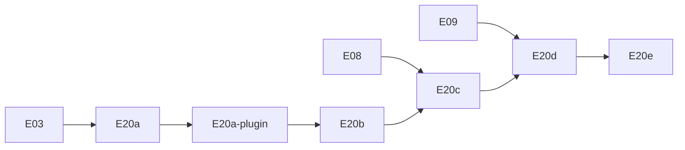

# Plano de Execução — OpenAPI gerado + Scalar

> **For agentic workers:** REQUIRED SUB-SKILL: Use `executing-plans` ou implementação inline task-by-task. Steps usam checkbox (`- [ ]`) para tracking.

**Goal:** Expor documentação interativa da API Commandix via OpenAPI gerado com [`@nestjs/swagger`](https://docs.nestjs.com/openapi/introduction) e UI Scalar, sem duplicar o contrato de [`05-api.md`](../spec/05-api.md).

**Architecture:** Seguir o [bootstrap oficial](https://docs.nestjs.com/openapi/introduction#bootstrap): `DocumentBuilder` + **`documentFactory`** (lazy `SwaggerModule.createDocument`) + `SwaggerModule.setup` só para expor o JSON (`ui: false`, `raw: ['json']`). Scalar (`@scalar/nestjs-api-reference`) consome esse JSON em `/api/openapi.json`. DTOs `*.dto.ts` documentados via [CLI Plugin](https://docs.nestjs.com/openapi/cli-plugin) (`classValidatorShim` + `esmCompatible: true`) e `@ApiProperty` onde o plugin não alcança (response DTOs, generics). JWT via [`addBearerAuth()` + `@ApiBearerAuth()`](https://docs.nestjs.com/openapi/security).

**Tech Stack:** NestJS 12 (ESM), `@nestjs/swagger`, `@scalar/nestjs-api-reference`, Vitest + supertest.

**Referência NestJS (leitura obrigatória por task):**

| Tópico | URL |
|--------|-----|
| Introdução / bootstrap | https://docs.nestjs.com/openapi/introduction |
| Tipos e parâmetros | https://docs.nestjs.com/openapi/types-and-parameters |
| Operations (tags, responses) | https://docs.nestjs.com/openapi/operations |
| Security (Bearer) | https://docs.nestjs.com/openapi/security |
| CLI Plugin | https://docs.nestjs.com/openapi/cli-plugin |

## Global Constraints

- Node **24.16.0**; TypeScript **6**; imports `@/` → `src/`; sufixo **`.js`**
- `configureApp(app)` roda **antes** de OpenAPI (`setGlobalPrefix('api/v1')`, pipes, CORS) — ver [hint sobre factory vs eager](https://docs.nestjs.com/openapi/introduction#bootstrap)
- Adapter **Express** (default Nest) — **não** usar Fastify; sem `@fastify/static`
- Projeto usa **`class-validator`** nos DTOs — **não** adotar `standardSchemaConverter` / Zod nesta entrega ([Standard Schema](https://docs.nestjs.com/openapi/introduction#standard-schema-zod-valibot) fica fora de escopo)
- `PartialType` / `PickType` etc. importar de **`@nestjs/swagger`**, não `@nestjs/mapped-types` ([CLI Plugin](https://docs.nestjs.com/openapi/cli-plugin#overview))
- Nunca expor `passwordHash`, `tokenHash`, `authKey` completo nos schemas
- Código em inglês; este plano em português
- Commits só quando solicitado

---

## Posicionamento no roadmap

| Código | Nome | Depende de | Entrega |
|--------|------|------------|---------|
| **E20a** | Infra OpenAPI + Scalar | E03 | ✅ JSON + Scalar UI |
| **E20a-plugin** | CLI Plugin Swagger | E20a | ✅ |
| **E20b** | Docs MVP | E06, E07 | health, bootstrap, login |
| **E20c** | Bearer + rotas públicas | E08 | Try-it JWT no Scalar |
| **E20d** | Docs por módulo | E09–E17 | refresh, integrations, executions |
| **E20e** | Docker + README | E18 | docs via Compose |



---

## Mapa de arquivos

| Arquivo | Responsabilidade |
|---------|------------------|
| `src/openapi/configure-openapi.ts` | `DocumentBuilder`, `documentFactory`, `SwaggerModule.setup`, mount Scalar |
| `src/openapi/openapi.constants.ts` | `ENABLE_API_DOCS`, paths, título |
| `src/openapi/swagger-document.options.ts` | `SwaggerDocumentOptions` (`operationIdFactory`, `extraModels`) |
| `src/main.ts` | `configureApp` → `configureOpenApi` |
| `nest-cli.json` | Plugin `@nestjs/swagger` com `esmCompatible: true` |
| `src/common/decorators/api-paginated-response.decorator.ts` | Envelope `{ data, meta }` via `getSchemaPath` + `allOf` |
| `src/**/dto/*.dto.ts` | Sufixo `.dto.ts` (plugin); `@ApiProperty` manual em responses |
| `src/**/*.controller.ts` | `@ApiTags`, `@ApiOperation`, shorthand `@Api*Response` |
| `test/openapi.e2e-spec.ts` | Smoke JSON + Scalar |

---

## Task 1: Dependências

**Files:**
- Modify: `nexus-backend/package.json`

- [ ] **Step 1: Instalar (somente `@nestjs/swagger` é exigido pelo Nest)**

```bash
cd nexus-backend
npm install --save @nestjs/swagger
npm install --save @scalar/nestjs-api-reference
```

> Ref: [Installation](https://docs.nestjs.com/openapi/introduction#installation)

- [ ] **Step 2: Verificar build**

```bash
npm run build
```

Expected: exit 0.

---

## Task 2: Constantes e feature flag

**Files:**
- Create: `nexus-backend/src/openapi/openapi.constants.ts`

- [ ] **Step 1: Criar constantes**

```typescript
export const ENABLE_API_DOCS =
  (process.env['ENABLE_API_DOCS'] ?? 'true').toLowerCase() !== 'false';

export const OPENAPI_TITLE = 'Commandix API';
export const OPENAPI_VERSION = '1.0';
export const OPENAPI_SETUP_PATH = '_openapi'; // path interno do SwaggerModule (sem UI)
export const OPENAPI_JSON_PATH = 'api/openapi.json'; // servido pelo setup (sem leading /)
export const OPENAPI_SCALAR_PATH = '/api/docs';
```

- [ ] **Step 2: `.env.example`**

```
ENABLE_API_DOCS=true
```

---

## Task 3: CLI Plugin Swagger (ESM)

**Files:**
- Modify: `nexus-backend/nest-cli.json`

> Ref: [Using the CLI plugin](https://docs.nestjs.com/openapi/cli-plugin#using-the-cli-plugin), opção `esmCompatible` para projetos `"type": "module"`.

- [ ] **Step 1: Configurar plugin**

```json
{
  "$schema": "https://json.schemastore.org/nest-cli",
  "collection": "@nestjs/schematics",
  "sourceRoot": "src",
  "compilerOptions": {
    "deleteOutDir": true,
    "plugins": [
      {
        "name": "@nestjs/swagger",
        "options": {
          "classValidatorShim": true,
          "introspectComments": true,
          "dtoFileNameSuffix": [".dto.ts"],
          "esmCompatible": true
        }
      }
    ]
  }
}
```

- [ ] **Step 2: Rebuild limpo**

```bash
rm -rf dist
npm run build
```

Expected: build OK; DTOs `*.dto.ts` passam a expor `@ApiProperty` no emit (verificar um `dist/**/login.dto.js` se necessário).

- [ ] **Step 3: Nota Vitest e2e**

O plugin roda no **`nest build`**, não no transform do Vitest ([troubleshooting ts-jest](https://docs.nestjs.com/openapi/cli-plugin#integration-with-ts-jest-e2e-tests) — analogia: e2e Vitest carrega TS direto). Para e2e:
- **Request DTOs** (`login.dto.ts`, `bootstrap-tenant.dto.ts`): manter `@ApiProperty` explícito **ou** aceitar schemas parciais nos testes e2e (paths/operations são o foco do smoke).
- **Response DTOs**: sempre `@ApiProperty` manual (não são inferidos pelo plugin em runtime Vitest).

---

## Task 4: Opções do documento OpenAPI

**Files:**
- Create: `nexus-backend/src/openapi/swagger-document.options.ts`

> Ref: [Document options](https://docs.nestjs.com/openapi/introduction#document-options)

- [ ] **Step 1: Centralizar `SwaggerDocumentOptions`**

```typescript
import type { SwaggerDocumentOptions } from '@nestjs/swagger';

export const swaggerDocumentOptions: SwaggerDocumentOptions = {
  operationIdFactory: (_controllerKey: string, methodKey: string) => methodKey,
  deepScanRoutes: true,
  autoTagControllers: true,
};
```

`operationIdFactory` gera IDs legíveis (`login`, `bootstrap`) em vez de `AuthController_login`.

- [ ] **Step 2: Reservar `extraModels`**

Quando houver envelopes genéricos, registrar aqui ou via `@ApiExtraModels()` ([Extra models](https://docs.nestjs.com/openapi/types-and-parameters#extra-models)).

---

## Task 5: Bootstrap OpenAPI + Scalar (padrão NestJS)

**Files:**
- Create: `nexus-backend/src/openapi/configure-openapi.ts`
- Modify: `nexus-backend/src/main.ts`

> Ref: [Bootstrap](https://docs.nestjs.com/openapi/introduction#bootstrap), [Setup options](https://docs.nestjs.com/openapi/introduction#setup-options)

**Interfaces:**
- Consumes: `configureApp(app)` já executado
- Produces: `configureOpenApi(app: INestApplication): void`

- [ ] **Step 1: Implementar `configure-openapi.ts`**

```typescript
import { INestApplication } from '@nestjs/common';
import { DocumentBuilder, SwaggerModule } from '@nestjs/swagger';
import { apiReference } from '@scalar/nestjs-api-reference';

import {
  ENABLE_API_DOCS,
  OPENAPI_JSON_PATH,
  OPENAPI_SCALAR_PATH,
  OPENAPI_SETUP_PATH,
  OPENAPI_TITLE,
  OPENAPI_VERSION,
} from '@/openapi/openapi.constants.js';
import { swaggerDocumentOptions } from '@/openapi/swagger-document.options.js';

export function configureOpenApi(app: INestApplication): void {
  if (!ENABLE_API_DOCS) {
    return;
  }

  const config = new DocumentBuilder()
    .setTitle(OPENAPI_TITLE)
    .setDescription(
      [
        'Commandix PoC — gestão de integrações multi-tenant.',
        '',
        '**Autenticação:**',
        '1. `POST /api/v1/auth/login`',
        '2. Authorize com Bearer `{accessToken}`',
        '3. Chamar rotas protegidas',
      ].join('\n'),
    )
    .setVersion(OPENAPI_VERSION)
    .addBearerAuth()
    .addTag('health')
    .addTag('tenants')
    .addTag('auth')
    .addTag('integrations')
    .addTag('executions')
    .build();

  // Factory lazy — recomendado pela doc NestJS (economiza init)
  const documentFactory = () =>
    SwaggerModule.createDocument(app, config, swaggerDocumentOptions);

  // Expõe só o JSON OpenAPI (sem Swagger UI nativo)
  SwaggerModule.setup(OPENAPI_SETUP_PATH, app, documentFactory, {
    ui: false,
    raw: ['json'],
    jsonDocumentUrl: OPENAPI_JSON_PATH,
  });

  // Scalar como camada de UI
  app.use(
    OPENAPI_SCALAR_PATH,
    apiReference({
      theme: 'default',
      url: `/${OPENAPI_JSON_PATH}`,
    }),
  );
}
```

Pontos alinhados à doc:
- **`documentFactory`** em função, não `createDocument()` eager.
- **`ui: false`** + **`raw: ['json']`** — desliga Swagger UI, mantém definição JSON ([Setup options](https://docs.nestjs.com/openapi/introduction#setup-options)).
- **`jsonDocumentUrl`** — path customizado (`/api/openapi.json`), equivalente ao exemplo `swagger/json` da doc.
- **`addBearerAuth()`** sem nome custom — pareia com `@ApiBearerAuth()` ([Security](https://docs.nestjs.com/openapi/security#bearer-authentication)).

- [ ] **Step 2: Integrar em `main.ts`**

```typescript
import { configureOpenApi } from '@/openapi/configure-openapi.js';

async function bootstrap() {
  const app = await NestFactory.create(AppModule);
  configureApp(app);
  configureOpenApi(app);
  await app.listen(process.env.PORT ?? 3000);
}
```

- [ ] **Step 3: Smoke manual**

```bash
npm run start:dev
curl -s http://localhost:3000/api/openapi.json | jq '.openapi, .info.title, .paths | keys | length'
curl -s -o /dev/null -w "%{http_code}\n" http://localhost:3000/api/docs
```

Expected: versão OpenAPI `3.x`; title `Commandix API`; HTTP `200` no Scalar.

---

## Task 6: Teste e2e da infra

**Files:**
- Create: `nexus-backend/test/openapi.e2e-spec.ts`

- [ ] **Step 1: Smoke test**

```typescript
import { INestApplication } from '@nestjs/common';
import { Test, TestingModule } from '@nestjs/testing';
import { afterAll, beforeAll, describe, expect, it } from 'vitest';
import request from 'supertest';
import { App } from 'supertest/types';

import { AppModule } from '@/app.module.js';
import { configureApp } from '@/configure-app.js';
import { configureOpenApi } from '@/openapi/configure-openapi.js';
import { db } from '@/prisma/db.js';

describe('OpenAPI + Scalar (e2e)', () => {
  let app: INestApplication<App>;

  beforeAll(async () => {
    process.env['ENABLE_API_DOCS'] = 'true';
    const moduleFixture: TestingModule = await Test.createTestingModule({
      imports: [AppModule],
    }).compile();

    app = moduleFixture.createNestApplication();
    configureApp(app);
    configureOpenApi(app);
    await app.init();
  });

  afterAll(async () => {
    await app.close();
    await db.close();
  });

  it('GET /api/openapi.json returns OpenAPI 3 document', async () => {
    const response = await request(app.getHttpServer())
      .get('/api/openapi.json')
      .expect(200);

    expect(response.body.openapi).toMatch(/^3\./);
    expect(response.body.paths['/api/v1/health']).toBeDefined();
  });

  it('GET /api/docs serves Scalar UI', async () => {
    const response = await request(app.getHttpServer())
      .get('/api/docs')
      .expect(200);

    expect(response.text.toLowerCase()).toContain('scalar');
  });

  it('ENABLE_API_DOCS=false skips routes', async () => {
    process.env['ENABLE_API_DOCS'] = 'false';
    const moduleFixture = await Test.createTestingModule({
      imports: [AppModule],
    }).compile();
    const disabledApp = moduleFixture.createNestApplication();
    configureApp(disabledApp);
    configureOpenApi(disabledApp);
    await disabledApp.init();

    await request(disabledApp.getHttpServer())
      .get('/api/openapi.json')
      .expect(404);

    await disabledApp.close();
    process.env['ENABLE_API_DOCS'] = 'true';
  });
});
```

- [ ] **Step 2: Rodar**

```bash
npm run test:e2e -- test/openapi.e2e-spec.ts
```

Expected: 3 passed.

---

## Task 7: DTOs de resposta + enums documentados

**Files:**
- Create: `nexus-backend/src/common/dto/user-summary.dto.ts`
- Create: `nexus-backend/src/common/dto/tenant-summary.dto.ts`
- Create: `nexus-backend/src/common/enums/role.enum.ts` (ou reexport do domínio)
- Create: `nexus-backend/src/auth/dto/login-response.dto.ts`
- Create: `nexus-backend/src/tenants/dto/bootstrap-response.dto.ts`

> Ref: [Types and parameters](https://docs.nestjs.com/openapi/types-and-parameters), [Enums schema](https://docs.nestjs.com/openapi/types-and-parameters#enums-schema)

Response DTOs **não** batem sufixo `.dto.ts` de request-only — usar `@ApiProperty` explícito.

- [ ] **Step 1: Enum reutilizável com `enumName`**

```typescript
export enum RoleEnum {
  ADMIN = 'ADMIN',
  VIEWER = 'VIEWER',
}

// em UserSummaryDto:
@ApiProperty({ enum: RoleEnum, enumName: 'Role' })
role!: RoleEnum;
```

- [ ] **Step 2: Response DTOs** (ver plano anterior — `LoginResponseDto`, `BootstrapTenantResponseDto`)

- [ ] **Step 3: `@ApiExtraModels` onde necessário**

Se um schema não for referenciado diretamente por `@Body()`, registrar no controller ou em `extraModels` ([Extra models](https://docs.nestjs.com/openapi/types-and-parameters#extra-models)).

---

## Task 8: Request DTOs — plugin + overrides

**Files:**
- Modify: `nexus-backend/src/auth/dto/login.dto.ts`
- Modify: `nexus-backend/src/tenants/dto/bootstrap-tenant.dto.ts`

> Ref: [Types and parameters](https://docs.nestjs.com/openapi/types-and-parameters) — plugin infere de `class-validator`; override com `@ApiProperty({ example })` onde a spec exige exemplos.

- [ ] **Step 1: Manter validators `class-validator`** (runtime inalterado)

- [ ] **Step 2: Adicionar `@ApiProperty` só para exemplos/descrições** que o plugin não cobre:

```typescript
@ApiProperty({ example: 'admin@acme.com' })
@IsEmail()
email!: string;
```

- [ ] **Step 3: `@ApiPropertyOptional()`** para campos opcionais futuros ([hint](https://docs.nestjs.com/openapi/types-and-parameters))

- [ ] **Step 4: Verificar** `GET /api/openapi.json` → `components.schemas.LoginDto`

---

## Task 9: Controllers — operations (MVP)

**Files:**
- Modify: `nexus-backend/src/app.controller.ts`
- Modify: `nexus-backend/src/auth/auth.controller.ts`
- Modify: `nexus-backend/src/tenants/tenants.controller.ts`

> Ref: [Operations](https://docs.nestjs.com/openapi/operations) — `@ApiTags`, shorthand responses.

- [ ] **Step 1: Health**

```typescript
@ApiTags('health')
@Get('health')
@ApiOperation({ summary: 'API healthcheck' })
@ApiOkResponse({ schema: { example: { status: 'ok' } } })
getHealth(): { status: string } { ... }
```

Com `autoTagControllers: true`, `@ApiTags('health')` é opcional se o controller se chamar `AppController` — preferir tag explícita para clareza no Scalar.

- [ ] **Step 2: Login**

```typescript
@ApiTags('auth')
@Post('login')
@HttpCode(200)
@ApiOperation({ summary: 'Login with email and password' })
@ApiOkResponse({ type: LoginResponseDto })
@ApiUnauthorizedResponse({ description: 'Invalid credentials' })
@ApiBadRequestResponse({ description: 'Validation error' })
login(@Body() dto: LoginDto) { ... }
```

- [ ] **Step 3: Bootstrap**

```typescript
@ApiTags('tenants')
@Post('bootstrap')
@ApiOperation({ summary: 'Create tenant and first ADMIN user' })
@ApiCreatedResponse({ type: BootstrapTenantResponseDto })
@ApiConflictResponse({ description: 'Duplicate slug or email' })
bootstrap(@Body() dto: BootstrapTenantDto) { ... }
```

- [ ] **Step 4: Atualizar e2e** — assert paths `/api/v1/auth/login`, `/api/v1/tenants/bootstrap`.

---

## Task 10: Segurança Bearer (pós E08)

**Dependência:** E08 — guards + `@Public()`.

> Ref: [Bearer authentication](https://docs.nestjs.com/openapi/security#bearer-authentication)

- [ ] **Step 1: Controllers protegidos**

```typescript
@ApiBearerAuth()
@ApiTags('integrations')
@Controller('integrations')
export class IntegrationsController {}
```

- [ ] **Step 2: Rotas públicas** — **sem** `@ApiBearerAuth()` (`health`, `login`, `bootstrap`, `refresh`)

- [ ] **Step 3 (opcional): respostas globais**

```typescript
const config = new DocumentBuilder()
  .addGlobalResponse({ status: 401, description: 'Missing or invalid access token' })
  .addGlobalResponse({ status: 500, description: 'Internal server error' })
  // ...
  .build();
```

([Global response](https://docs.nestjs.com/openapi/operations#responses))

- [ ] **Step 4: Scalar** — fluxo Authorize documentado na `description` do `DocumentBuilder` (Task 5).

---

## Task 11: Envelope paginado `{ data, meta }`

**Files:**
- Create: `nexus-backend/src/common/dto/pagination-meta.dto.ts`
- Create: `nexus-backend/src/common/dto/paginated-response.dto.ts`
- Create: `nexus-backend/src/common/decorators/api-paginated-response.decorator.ts`

> Ref: [Advanced: Generic ApiResponse](https://docs.nestjs.com/openapi/operations#advanced-generic-apiresponse) — adaptado ao envelope Commandix §5.0.

- [ ] **Step 1: Base + meta DTOs**

```typescript
export class PaginationMetaDto {
  @ApiProperty({ example: 1 }) page!: number;
  @ApiProperty({ example: 20 }) limit!: number;
  @ApiProperty({ example: 42 }) total!: number;
  @ApiProperty({ example: 3 }) totalPages!: number;
  @ApiProperty() hasNextPage!: boolean;
  @ApiProperty() hasPreviousPage!: boolean;
}

export class PaginatedResponseDto {
  @ApiProperty({ type: PaginationMetaDto })
  meta!: PaginationMetaDto;
  // `data` documentado no decorator genérico (TypeScript não preserva generics)
}
```

- [ ] **Step 2: Decorator reutilizável**

```typescript
import { applyDecorators, Type } from '@nestjs/common';
import { ApiExtraModels, ApiOkResponse, getSchemaPath } from '@nestjs/swagger';

export const ApiPaginatedResponse = <TModel extends Type>(model: TModel) =>
  applyDecorators(
    ApiExtraModels(PaginatedResponseDto, model),
    ApiOkResponse({
      schema: {
        title: `PaginatedResponseOf${model.name}`,
        allOf: [
          { $ref: getSchemaPath(PaginatedResponseDto) },
          {
            properties: {
              data: {
                type: 'array',
                items: { $ref: getSchemaPath(model) },
              },
            },
          },
        ],
      },
    }),
  );
```

- [ ] **Step 3: Uso em listagens (E11+)**

```typescript
@ApiPaginatedResponse(IntegrationListItemDto)
@Get()
findAll() { ... }
```

- [ ] **Step 4: Query paginação** — `@ApiQuery` para `page`/`limit` ou comentários JSDoc `@param page` (plugin v12 gera `@ApiQuery` — [CLI Plugin](https://docs.nestjs.com/openapi/cli-plugin#comments-introspection)).

---

## Task 12: Documentação incremental por entrega

Executar **no mesmo PR** de cada módulo:

| Entrega | Rotas | Decorators-chave |
|---------|-------|------------------|
| E09 | refresh, logout | `@ApiOkResponse`, `@ApiNoContentResponse` |
| E10 | bootstrap 429 | `@ApiTooManyRequestsResponse` |
| E11–E13 | integrations CRUD | `@ApiBearerAuth`, `@ApiParam`, `@ApiPaginatedResponse` |
| E15 | trigger | `@ApiCreatedResponse` |
| E16–E17 | executions | filtros `@ApiQuery`, date range |

Checklist por rota ([Operations](https://docs.nestjs.com/openapi/operations)):
- [ ] `@ApiOperation({ summary })` ou JSDoc no handler (plugin → summary)
- [ ] Shorthand `@Api*Response` com `type` ou `description`
- [ ] `@ApiBody({ type })` se array/genérico ([hint @ApiBody](https://docs.nestjs.com/openapi/types-and-parameters))
- [ ] Enums com `enumName` (`IntegrationType`, `ExecutionStatus`)
- [ ] `authKey` mascarado nos response DTOs (`example: '****-key'`)

---

## Task 13: Docker e proxy

**Dependência:** E18.

- [ ] **Step 1:** `ENABLE_API_DOCS=true` no serviço `api` do Compose
- [ ] **Step 2:** nginx `location /api/` já proxia `/api/openapi.json` e `/api/docs`
- [ ] **Step 3:** Smoke `curl http://localhost:3000/api/openapi.json`

---

## Task 14: README e critério de done E20

- [ ] **URLs documentadas**

| URL | Conteúdo |
|-----|----------|
| `/api/docs` | Scalar UI |
| `/api/openapi.json` | OpenAPI 3.x (via `SwaggerModule.setup` + `jsonDocumentUrl`) |

- [ ] **Critério de done**

- [ ] Padrão NestJS: `documentFactory` + `SwaggerModule.setup` com `ui: false`, `raw: ['json']`
- [ ] Scalar em `/api/docs`
- [ ] CLI Plugin ativo (`esmCompatible: true`)
- [ ] MVP: health, bootstrap, login documentados
- [ ] `@ApiBearerAuth()` após E08
- [ ] `ENABLE_API_DOCS=false` → 404 nos endpoints de docs
- [ ] `test/openapi.e2e-spec.ts` passa
- [ ] Sem secrets nos schemas

---

## Verificação final

```bash
cd nexus-backend
rm -rf dist && npm run build
npm run lint && npm test && npm run test:e2e && npm run start:dev
# Browser: http://localhost:3000/api/docs
# JSON:    http://localhost:3000/api/openapi.json
```

---

## Self-review (spec × doc NestJS)

| Requisito | Task | Nota NestJS |
|-----------|------|-------------|
| Health §5.1 | 9 | `@ApiOkResponse` |
| Auth §5.2 | 7–10, 12 | `addBearerAuth` + `@ApiBearerAuth` |
| Paginação §5.0 | 11 | `allOf` + `getSchemaPath` |
| Enums domínio | 7, 12 | `enumName` |
| Rate limit 429 | 12 | `@ApiTooManyRequestsResponse` |
| Campos sensíveis | 7, 12 | `@ApiHideProperty()` se algum field interno vazar para DTO |

---

## Opções de execução

**Plano:** `docs/plans/openapi-scalar.md`

1. **Inline** — E20a + plugin + E20b agora; E20c–E20d com E08–E17.
2. **Incremental** — infra (Tasks 1–6) agora; decorators por entrega (Task 12).

Qual abordagem prefere?
