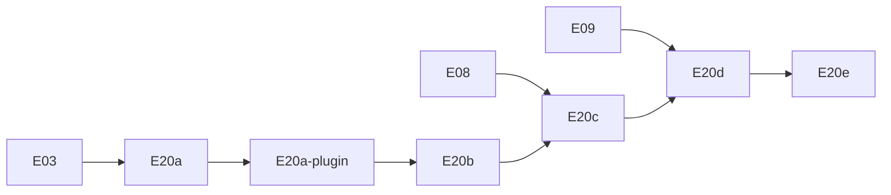

# Plano de Execução — OpenAPI gerado + Scalar

> **Revertido em 2026-09-06** (commit `5af6c9a`, "Retorno a UI padrão do Swagger"): a UI Scalar descrita abaixo (`ui: false`, `raw: ['json']`) foi removida — a implementação atual usa a **Swagger UI padrão** do `@nestjs/swagger` (`SwaggerModule.setup` com UI habilitada). Motivo: simplificar a stack, sem depender de `@scalar/nestjs-api-reference`. Ver `src/openapi/`, `readme.md` § Serviços e [05-api §5.6](../spec/05-api.md#56-documentação-openapi). Documento abaixo preservado como registro histórico da decisão original — não reflete o estado atual, exceto onde marcado.

> **For agentic workers:** REQUIRED SUB-SKILL: Use `executing-plans` ou implementação inline task-by-task. Steps usam checkbox (`- [ ]`) para tracking.

**Goal:** Expor documentação interativa da API Commandix via OpenAPI gerado com [`@nestjs/swagger`](https://docs.nestjs.com/openapi/introduction) e UI Scalar, sem duplicar o contrato de [`05-api.md`](../spec/05-api.md).

**Architecture:**
- Seguir o [bootstrap oficial](https://docs.nestjs.com/openapi/introduction#bootstrap): `DocumentBuilder` + **`documentFactory`** (lazy `SwaggerModule.createDocument`) + `SwaggerModule.setup` só para expor o JSON (`ui: false`, `raw: ['json']`).
- DTOs `*.dto.ts` documentados via [CLI Plugin](https://docs.nestjs.com/openapi/cli-plugin) (`classValidatorShim` + `esmCompatible: true`) e `@ApiProperty` onde o plugin não alcança (response DTOs, generics). JWT via [`addBearerAuth()` + `@ApiBearerAuth()`](https://docs.nestjs.com/openapi/security).

**Tech Stack:** NestJS 12 (ESM), `@nestjs/swagger`, Vitest + supertest.

**Referência NestJS (leitura obrigatória por task):**

| Tópico | URL |
|--------|-----|
| Introdução / bootstrap | https://docs.nestjs.com/openapi/introduction |
| Tipos e parâmetros | https://docs.nestjs.com/openapi/types-and-parameters |
| Operations (tags, responses) | https://docs.nestjs.com/openapi/operations |
| Security (Bearer) | https://docs.nestjs.com/openapi/security |
| CLI Plugin | https://docs.nestjs.com/openapi/cli-plugin |

## Global Constraints

- Node **24.16.0**; TypeScript **6**; imports `@/` → `src/`; sufixo **`.js`**
- `configureApp(app)` roda **antes** de OpenAPI (`setGlobalPrefix('api/v1')`, pipes, CORS) — ver [hint sobre factory vs eager](https://docs.nestjs.com/openapi/introduction#bootstrap)
- Adapter **Express**
- Projeto usa **`class-validator`** nos DTOs
- `PartialType` / `PickType` etc. importar de **`@nestjs/swagger`**, não `@nestjs/mapped-types` ([CLI Plugin](https://docs.nestjs.com/openapi/cli-plugin#overview))
- Nunca expor `passwordHash`, `tokenHash`, `authKey` completo nos schemas
- Código em inglês; plano em português
- Commits só quando solicitado

---

## Posicionamento no roadmap

| Código | Nome | Depende de | Entrega |
|--------|------|------------|---------|
| **E20a** | Infra OpenAPI + Scalar | E03 | ✅ JSON |
| **E20a-plugin** | CLI Plugin Swagger | E20a | ✅ |
| **E20b** | Docs MVP | E06, E07 | ✅ health, bootstrap, login |
| **E20c** | Bearer + rotas públicas | E08 | ✅ Try-it JWT |
| **E20d** | Docs por módulo | E09–E17 | refresh, integrations, executions |
| **E20e** | Docker + README | E18 | docs via Compose |

---

## Mapa de arquivos

| Arquivo | Responsabilidade |
|---------|------------------|
| `src/openapi/configure-openapi.ts` | `DocumentBuilder`, `documentFactory`, `SwaggerModule.setup` |
| `src/openapi/openapi.constants.ts` | `ENABLE_API_DOCS`, paths, título |
| `src/openapi/swagger-document.options.ts` | `SwaggerDocumentOptions` (`operationIdFactory`, `extraModels`) |
| `src/main.ts` | `configureApp` → `configureOpenApi` |
| `nest-cli.json` | Plugin `@nestjs/swagger` com `esmCompatible: true` |
| `src/common/decorators/api-paginated-response.decorator.ts` | Envelope `{ data, meta }` via `getSchemaPath` + `allOf` |
| `src/**/dto/*.dto.ts` | Sufixo `.dto.ts` (plugin); `@ApiProperty` manual em responses |
| `src/**/*.controller.ts` | `@ApiTags`, `@ApiOperation`, shorthand `@Api*Response` |
| `test/openapi.e2e-spec.ts` | Smoke JSON |

## Task 13: Docker e proxy

**Dependência:** E18.

- [ ] **Step 2:** nginx `location /api/` proxiando `/api/openapi.json` e `/api/docs` — **não aplicável hoje**: não existe serviço nginx neste projeto (o `frontend` está comentado em `docker/production/docker-compose.yml`, sem proxy reverso ainda). Revisitar quando o frontend/proxy for criado — ver [`docs/todo/openapi-nginx-proxy-assumption.md`](../todo/openapi-nginx-proxy-assumption.md)

---

## Self-review (spec × doc NestJS)

| Requisito | Task | Nota NestJS |
|-----------|------|-------------|
| Health §5.1 | 9 | `@ApiOkResponse` |
| Auth §5.2 | 7–10, 12 | `addBearerAuth` + `@ApiBearerAuth` |
| Paginação §5.0 | 11 | `allOf` + `getSchemaPath` |
| Enums domínio | 7, 12 | `enumName` |
| Rate limit 429 | 12 | `@ApiTooManyRequestsResponse` |
| Campos sensíveis | 7, 12 | `@ApiHideProperty()` se algum field interno vazar para DTO |
