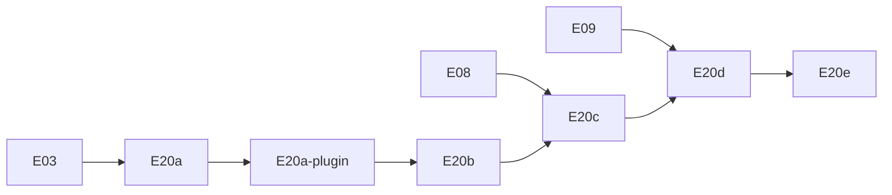

# Plano de Execução — OpenAPI gerado + Scalar

> **Atualização (2026-09-06):** Scalar (`@scalar/nestjs-api-reference`) foi removido do projeto. `/api/docs` agora serve a UI padrão do `@nestjs/swagger` (`SwaggerModule.setup` com `ui` no default, sem `apiReference()`). As referências a Scalar abaixo são históricas — refletem a decisão original, já superada.

> **For agentic workers:** REQUIRED SUB-SKILL: Use `executing-plans` ou implementação inline task-by-task. Steps usam checkbox (`- [ ]`) para tracking.

**Goal:** Expor documentação interativa da API Commandix via OpenAPI gerado com [`@nestjs/swagger`](https://docs.nestjs.com/openapi/introduction) e UI Scalar, sem duplicar o contrato de [`05-api.md`](../spec/05-api.md).

**Architecture:**
- Seguir o [bootstrap oficial](https://docs.nestjs.com/openapi/introduction#bootstrap): `DocumentBuilder` + **`documentFactory`** (lazy `SwaggerModule.createDocument`) + `SwaggerModule.setup` só para expor o JSON (`ui: false`, `raw: ['json']`).
- DTOs `*.dto.ts` documentados via [CLI Plugin](https://docs.nestjs.com/openapi/cli-plugin) (`classValidatorShim` + `esmCompatible: true`) e `@ApiProperty` onde o plugin não alcança (response DTOs, generics). JWT via [`addBearerAuth()` + `@ApiBearerAuth()`](https://docs.nestjs.com/openapi/security).

**Tech Stack:** NestJS 12 (ESM), `@nestjs/swagger`, Vitest + supertest.

**Referência NestJS (leitura obrigatória por task):**

| Tópico | URL |
|--------|-----|
| Introdução / bootstrap | https://docs.nestjs.com/openapi/introduction |
| Tipos e parâmetros | https://docs.nestjs.com/openapi/types-and-parameters |
| Operations (tags, responses) | https://docs.nestjs.com/openapi/operations |
| Security (Bearer) | https://docs.nestjs.com/openapi/security |
| CLI Plugin | https://docs.nestjs.com/openapi/cli-plugin |

## Global Constraints

- Node **24.16.0**; TypeScript **6**; imports `@/` → `src/`; sufixo **`.js`**
- `configureApp(app)` roda **antes** de OpenAPI (`setGlobalPrefix('api/v1')`, pipes, CORS) — ver [hint sobre factory vs eager](https://docs.nestjs.com/openapi/introduction#bootstrap)
- Adapter **Express** (default Nest) — **não** usar Fastify; sem `@fastify/static`
- Projeto usa **`class-validator`** nos DTOs — **não** adotar `standardSchemaConverter` / Zod nesta entrega ([Standard Schema](https://docs.nestjs.com/openapi/introduction#standard-schema-zod-valibot) fica fora de escopo)
- `PartialType` / `PickType` etc. importar de **`@nestjs/swagger`**, não `@nestjs/mapped-types` ([CLI Plugin](https://docs.nestjs.com/openapi/cli-plugin#overview))
- Nunca expor `passwordHash`, `tokenHash`, `authKey` completo nos schemas
- Código em inglês; este plano em português
- Commits só quando solicitado

---

## Posicionamento no roadmap

| Código | Nome | Depende de | Entrega |
|--------|------|------------|---------|
| **E20a** | Infra OpenAPI + Scalar | E03 | ✅ JSON |
| **E20a-plugin** | CLI Plugin Swagger | E20a | ✅ |
| **E20b** | Docs MVP | E06, E07 | ✅ health, bootstrap, login |
| **E20c** | Bearer + rotas públicas | E08 | ✅ Try-it JWT |
| **E20d** | Docs por módulo | E09–E17 | refresh, integrations, executions |
| **E20e** | Docker + README | E18 | docs via Compose |



---

## Mapa de arquivos

| Arquivo | Responsabilidade |
|---------|------------------|
| `src/openapi/configure-openapi.ts` | `DocumentBuilder`, `documentFactory`, `SwaggerModule.setup` |
| `src/openapi/openapi.constants.ts` | `ENABLE_API_DOCS`, paths, título |
| `src/openapi/swagger-document.options.ts` | `SwaggerDocumentOptions` (`operationIdFactory`, `extraModels`) |
| `src/main.ts` | `configureApp` → `configureOpenApi` |
| `nest-cli.json` | Plugin `@nestjs/swagger` com `esmCompatible: true` |
| `src/common/decorators/api-paginated-response.decorator.ts` | Envelope `{ data, meta }` via `getSchemaPath` + `allOf` |
| `src/**/dto/*.dto.ts` | Sufixo `.dto.ts` (plugin); `@ApiProperty` manual em responses |
| `src/**/*.controller.ts` | `@ApiTags`, `@ApiOperation`, shorthand `@Api*Response` |
| `test/openapi.e2e-spec.ts` | Smoke JSON |

---

## Task 11: Envelope paginado `{ data, meta }`

**Files:**
- Create: `nexus-backend/src/common/dto/pagination-meta.dto.ts`
- Create: `nexus-backend/src/common/dto/paginated-response.dto.ts`
- Create: `nexus-backend/src/common/decorators/api-paginated-response.decorator.ts`

> Ref: [Advanced: Generic ApiResponse](https://docs.nestjs.com/openapi/operations#advanced-generic-apiresponse) — adaptado ao envelope Commandix §5.0.

- [ ] **Step 2: Decorator reutilizável**

```typescript
import { applyDecorators, Type } from '@nestjs/common';
import { ApiExtraModels, ApiOkResponse, getSchemaPath } from '@nestjs/swagger';

export const ApiPaginatedResponse = <TModel extends Type>(model: TModel) =>
  applyDecorators(
    ApiExtraModels(PaginatedResponseDto, model),
    ApiOkResponse({
      schema: {
        title: `PaginatedResponseOf${model.name}`,
        allOf: [
          { $ref: getSchemaPath(PaginatedResponseDto) },
          {
            properties: {
              data: {
                type: 'array',
                items: { $ref: getSchemaPath(model) },
              },
            },
          },
        ],
      },
    }),
  );
```

- [ ] **Step 3: Uso em listagens (E11+)**

```typescript
@ApiPaginatedResponse(IntegrationListItemDto)
@Get()
findAll() { ... }
```

- [ ] **Step 4: Query paginação** — `@ApiQuery` para `page`/`limit` ou comentários JSDoc `@param page` (plugin v12 gera `@ApiQuery` — [CLI Plugin](https://docs.nestjs.com/openapi/cli-plugin#comments-introspection)).

---

## Task 12: Documentação incremental por entrega

Executar **no mesmo PR** de cada módulo:

| Entrega | Rotas | Decorators-chave |
|---------|-------|------------------|
| E09 | refresh, logout | `@ApiOkResponse`, `@ApiNoContentResponse` |
| E10 | bootstrap 429 | `@ApiTooManyRequestsResponse` |
| E11–E13 | integrations CRUD | `@ApiBearerAuth`, `@ApiParam`, `@ApiPaginatedResponse` |
| E15 | trigger | `@ApiCreatedResponse` |
| E16–E17 | executions | filtros `@ApiQuery`, date range |

Checklist por rota ([Operations](https://docs.nestjs.com/openapi/operations)):
- [ ] `@ApiOperation({ summary })` ou JSDoc no handler (plugin → summary)
- [ ] Shorthand `@Api*Response` com `type` ou `description`
- [ ] `@ApiBody({ type })` se array/genérico ([hint @ApiBody](https://docs.nestjs.com/openapi/types-and-parameters))
- [ ] Enums com `enumName` (`IntegrationType`, `ExecutionStatus`)
- [ ] `authKey` mascarado nos response DTOs (`example: '****-key'`)

---

## Task 13: Docker e proxy

**Dependência:** E18.

- [ ] **Step 1:** `ENABLE_API_DOCS=true` no serviço `api` do Compose
- [ ] **Step 2:** nginx `location /api/` já proxia `/api/openapi.json` e `/api/docs`
- [ ] **Step 3:** Smoke `curl http://localhost:3000/api/openapi.json`

---

## Task 14: README e critério de done E20

- [ ] **URLs documentadas**

| URL | Conteúdo |
|-----|----------|
| `/api/docs` | Scalar UI |
| `/api/openapi.json` | OpenAPI 3.x (via `SwaggerModule.setup` + `jsonDocumentUrl`) |

- [ ] **Critério de done**

- [ ] Padrão NestJS: `documentFactory` + `SwaggerModule.setup` com `ui: false`, `raw: ['json']`
- [ ] Scalar em `/api/docs`
- [ ] CLI Plugin ativo (`esmCompatible: true`)
- [ ] MVP: health, bootstrap, login documentados
- [ ] `@ApiBearerAuth()` após E08
- [ ] `ENABLE_API_DOCS=false` → 404 nos endpoints de docs
- [ ] `test/openapi.e2e-spec.ts` passa
- [ ] Sem secrets nos schemas

---

## Verificação final

```bash
cd nexus-backend
rm -rf dist && npm run build
npm run lint && npm test && npm run test:e2e && npm run start:dev
# Browser: http://localhost:3000/api/docs
# JSON:    http://localhost:3000/api/openapi.json
```

---

## Self-review (spec × doc NestJS)

| Requisito | Task | Nota NestJS |
|-----------|------|-------------|
| Health §5.1 | 9 | `@ApiOkResponse` |
| Auth §5.2 | 7–10, 12 | `addBearerAuth` + `@ApiBearerAuth` |
| Paginação §5.0 | 11 | `allOf` + `getSchemaPath` |
| Enums domínio | 7, 12 | `enumName` |
| Rate limit 429 | 12 | `@ApiTooManyRequestsResponse` |
| Campos sensíveis | 7, 12 | `@ApiHideProperty()` se algum field interno vazar para DTO |

---

## Opções de execução

**Plano:** `docs/plans/openapi-scalar.md`

1. **Inline** — E20a + plugin + E20b agora; E20c–E20d com E08–E17.
2. **Incremental** — infra (Tasks 1–6) agora; decorators por entrega (Task 12).

Qual abordagem prefere?
