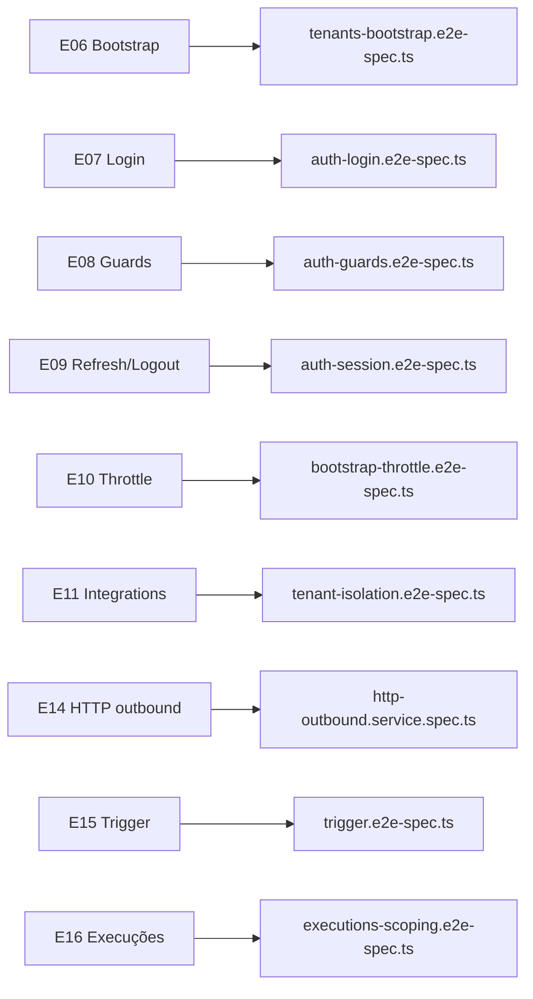

# Plano de Testes — Commandix PoC

> **Objetivo:** garantir cobertura mínima obrigatória da PoC e testes incrementais por entrega.  
> **Fonte de verdade:** [`AGENTS.md`](../../AGENTS.md), [`docs/spec/10-criterios.md`](../spec/10-criterios.md), [`docs/plans/backend-entregas.md`](./backend-entregas.md).

---

## Estado atual (baseline E03–E05)

| Componente | Unit | E2E | Status |
|------------|------|-----|--------|
| `AppController` (health + root) | ✅ `app.controller.spec.ts` | ✅ `test/app.e2e-spec.ts` | Coberto |
| `configureApp` / `ValidationPipe` | — | ✅ `test/validation-pipe.e2e-spec.ts` | Coberto |
| `pagination.util` | ✅ `pagination.util.spec.ts` | — | Coberto |
| `maskAuthKey` | ✅ `mask-auth-key.util.spec.ts` | — | Coberto |
| `PaginationQueryDto` | ✅ `pagination-query.dto.spec.ts` | — | Coberto |
| `DatabaseModule` / `DatabaseService` | ❌ | ❌ | Aceitável (wrapper fino) |
| Seed idempotente | — | ✅ `test/seed.e2e-spec.ts` *(skip sem `DATABASE_URL`)* | Coberto |
| Testes críticos (spec §10) | ❌ | ❌ | Pendente (E06–E17) |

**Comandos:** `npm test` (unit) · `npm run test:e2e` (e2e) — ambos em `nexus-backend/`.

---

## Princípios

1. **Testar junto com a entrega** — não acumular tudo em E19; cada slice (E06, E08, E11…) traz seus testes.
2. **Vitest + supertest** — stack já configurada (`vitest.config.ts`, `vitest.config.e2e.ts`).
3. **Escopo mínimo** — cobrir comportamento de negócio e segurança; evitar testes triviais de boilerplate.
4. **Multi-tenancy desde E11** — cross-tenant → 404 em todo teste de integração/execução.
5. **Mock HTTP externo** — trigger e outbound nunca dependem de webhook real.
6. **Imports nos testes** — `@/` funciona via Vitest (`resolve.tsconfigPaths`); preferir `@/` em imports de `src/`.

---

## Fase B — Testes por slice (E06–E17)

Adicionar testes **na mesma entrega** que implementa a feature.



### E06 — Bootstrap de tenant

**Arquivo:** `test/tenants-bootstrap.e2e-spec.ts`

| Cenário | Esperado |
|---------|----------|
| Bootstrap válido | `201`; tenant + admin criados |
| Slug duplicado | `409` |
| Resposta | Sem `passwordHash` |

---

### E07 — Login

**Arquivo:** `test/auth-login.e2e-spec.ts`

| Cenário | Esperado |
|---------|----------|
| Credenciais seed (`admin@acme.com`) | `200`; `accessToken`, `refreshToken`, `user` |
| Senha incorreta | `401` |
| Email inexistente | `401` |

---

### E08 — JWT + Guards

**Arquivo:** `test/auth-guards.e2e-spec.ts`

| Cenário | Esperado |
|---------|----------|
| Rota protegida sem token | `401` |
| Token válido | `@CurrentUser()` populado |
| VIEWER em rota `@Roles('ADMIN')` | `403` |
| Rotas públicas (health, login, bootstrap) | `200` / `201` sem token |

---

### E09 — Refresh + Logout

**Arquivo:** `test/auth-session.e2e-spec.ts`

| Cenário | Esperado |
|---------|----------|
| `POST /auth/refresh` com token válido | `200`; novo `accessToken` |
| Refresh após logout | `401` |
| Logout revoga só o token enviado | Outro refresh do mesmo user continua válido |
| Refresh inválido/expirado | `401` |

---

### E10 — Rate limit bootstrap

**Arquivo:** `test/bootstrap-throttle.e2e-spec.ts`

| Cenário | Esperado |
|---------|----------|
| 6ª requisição bootstrap no mesmo IP/minuto | `429` |
| `POST /auth/login` | Não afetado pelo throttle |

---

### E11–E13 — Integrations CRUD

**Arquivo:** `test/tenant-isolation.e2e-spec.ts`

| Cenário | Esperado |
|---------|----------|
| Admin cria integração | `201`; `authKey` mascarada na resposta |
| GET/PATCH/DELETE de outro tenant | `404` |
| VIEWER em POST/PATCH/DELETE | `403` |
| PATCH `{ isActive: false }` | Integração desativada |
| DELETE | Hard delete + cascade execuções |
| PATCH body `{}` | `400` |

---

### E14 — HTTP outbound

**Arquivo:** `src/integrations/http-outbound.service.spec.ts` (unit)

| Cenário | Esperado |
|---------|----------|
| Resposta 2xx | `httpStatusCode` preenchido; body capturado |
| Resposta 4xx/5xx | `httpStatusCode` preenchido; sem retry |
| Timeout / erro de rede | `httpStatusCode: null` |
| `customHeaders` + `authKey` | `Authorization: Bearer` sobrescreve header homônimo |

---

### E15 — Trigger + execução

**Arquivo:** `test/trigger.e2e-spec.ts`

| Cenário | Esperado |
|---------|----------|
| Integração inativa | Erro (`400` ou `404` conforme implementação) |
| Mock 2xx | `SUCCESS`; execução persistida |
| Mock 4xx | `FAILURE`; `httpStatusCode` preenchido |
| Mock timeout | `FAILURE`; `httpStatusCode: null` |
| Body > 10 240 bytes | Truncado + sufixo `… [truncated]` na persistência |
| Merge payload | Shallow: `{ ...defaultPayload, ...payload }` |

---

### E16–E17 — Execuções

**Arquivo:** `test/executions-scoping.e2e-spec.ts`

| Cenário | Esperado |
|---------|----------|
| Listagem por integração | Paginação `{ data, meta }`; `executedAt DESC` |
| Filtros `status`, `from`, `to` | Inclusivos UTC; `from > to` → `400` |
| Integração de outro tenant | `404` |
| `GET /executions/:id` cross-tenant | `404` |
| Detalhe | `requestPayload` e `responseBody` completos (já truncados no banco) |

---

## Fase C — E19 consolidado (após E17)

Objetivo: suite mínima exigida em [10-criterios § Testes críticos](../spec/10-criterios.md).

### Arquivos finais (podem absorver testes das Fases B)

| Sub | Foco | Arquivo |
|-----|------|---------|
| E19a | Tenant isolation (integrations) | `test/tenant-isolation.e2e-spec.ts` |
| E19b | Auth guards (401/403) | `test/auth-guards.e2e-spec.ts` |
| E19c | Trigger (SUCCESS/FAILURE/timeout/truncamento) | `test/trigger.e2e-spec.ts` |
| E19d | Scoping execuções | `test/executions-scoping.e2e-spec.ts` |

### Infra de teste (criar antes de E06 e2e)

```
nexus-backend/test/
├── helpers/
│   ├── test-app.factory.ts      # bootstrap Nest + configureApp
│   ├── test-db.setup.ts         # migrate + DATABASE_URL de teste
│   └── auth.helper.ts           # 2 tenants, tokens ADMIN/VIEWER
├── tenant-isolation.e2e-spec.ts
├── auth-guards.e2e-spec.ts
├── trigger.e2e-spec.ts
└── executions-scoping.e2e-spec.ts
```

### Decisões de setup

| Tópico | Recomendação |
|--------|--------------|
| Banco | PostgreSQL separado (`DATABASE_URL` em `.env.test.local`, gitignored) |
| Isolamento | `beforeEach` limpa dados de teste ou transação com rollback |
| HTTP externo | Mock de `fetch` / `undici` — sem webhook real |
| CI | [`.github/workflows/ci.yml`](../../.github/workflows/ci.yml) — lint, test, build, Docker Compose |

### Critério de done E19

- [ ] Cross-tenant → `404` em integração e execução
- [ ] Role insuficiente → `403`
- [ ] Trigger: SUCCESS / FAILURE / timeout + truncamento 10 240 bytes
- [ ] `npm test` e `npm run test:e2e` verdes

---

## Ordem de execução

```
Fase A (PaginationQueryDto)  →  agora
Fase B (por slice)           →  junto com E06, E07, E08, E09, E10, E11–E17
Fase C (E19 consolidado)     →  após E17; refatorar helpers se necessário
```

**Paralelizável:** A1 independente; E14 unit tests paralelos a E11–E13.

---

## Mapa entrega → teste

| Entrega backend | Arquivo(s) de teste |
|-----------------|---------------------|
| E03 (baseline) | `app.controller.spec.ts`, `app.e2e-spec.ts`, `validation-pipe.e2e-spec.ts` ✅ |
| E05 (common) | `pagination.util.spec.ts`, `mask-auth-key.util.spec.ts`, `pagination-query.dto.spec.ts` ✅ |
| E06 | `tenants-bootstrap.e2e-spec.ts` |
| E07 | `auth-login.e2e-spec.ts` |
| E08 | `auth-guards.e2e-spec.ts` |
| E09 | `auth-session.e2e-spec.ts` |
| E10 | `bootstrap-throttle.e2e-spec.ts` |
| E11–E13 | `tenant-isolation.e2e-spec.ts` |
| E14 | `http-outbound.service.spec.ts` |
| E15 | `trigger.e2e-spec.ts` |
| E16–E17 | `executions-scoping.e2e-spec.ts` |
| E19 | Consolidação + helpers |

---

## Referências

| Tópico | Documento |
|--------|-----------|
| Critérios de avaliação | [10-criterios.md](../spec/10-criterios.md) |
| Checklist | [11-checklist.md](../spec/11-checklist.md) |
| Entregas backend | [backend-entregas.md](./backend-entregas.md) |
| API | [05-api.md](../spec/05-api.md) |
| Regras NestJS | [.cursor/rules/nestjs-backend.mdc](../../.cursor/rules/nestjs-backend.mdc) |
