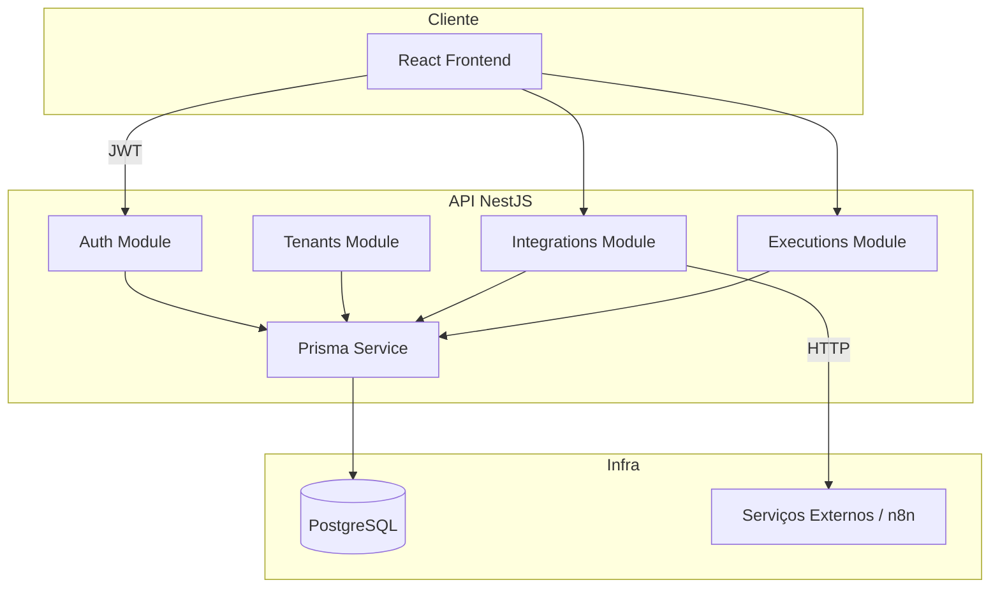
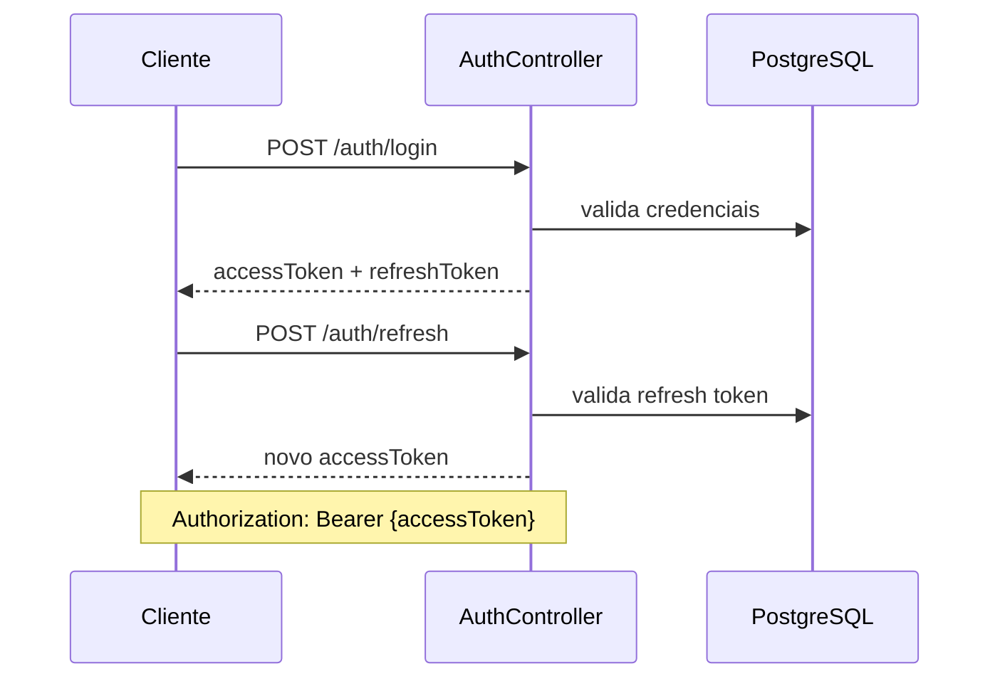

# 3. Arquitetura

[← Índice](./README.md)

## 3.1 Diagrama de contexto



## 3.2 Módulos NestJS

```
src/
├── auth/           # login, refresh, JWT strategy, guards
├── tenants/        # bootstrap de tenant + admin
├── users/          # perfil, listagem (opcional)
├── integrations/   # CRUD + trigger
├── executions/     # listagem e detalhe
├── prisma/         # PrismaService global
└── common/         # decorators, filters, pipes, guards compartilhados
    ├── decorators/ # @CurrentUser(), @Roles()
    ├── guards/     # JwtAuthGuard, RolesGuard, TenantGuard
    └── interceptors/
```

## 3.3 Multi-tenancy — estratégia

**Abordagem recomendada:** tenant ID no JWT + filtro explícito em todas as queries.

```typescript
// Exemplo: nunca confiar em tenantId vindo do body
const integration = await prisma.integration.findFirst({
  where: { id, tenantId: user.tenantId },
});
if (!integration) throw new NotFoundException();
```

**Alternativa aceitável:** middleware que injeta `tenantId` no contexto da request via decorator customizado.

**Proibido:** retornar recurso de outro tenant mesmo que o ID exista (usar 404, não 403, para não vazar existência).

## 3.4 Fluxo de autenticação


