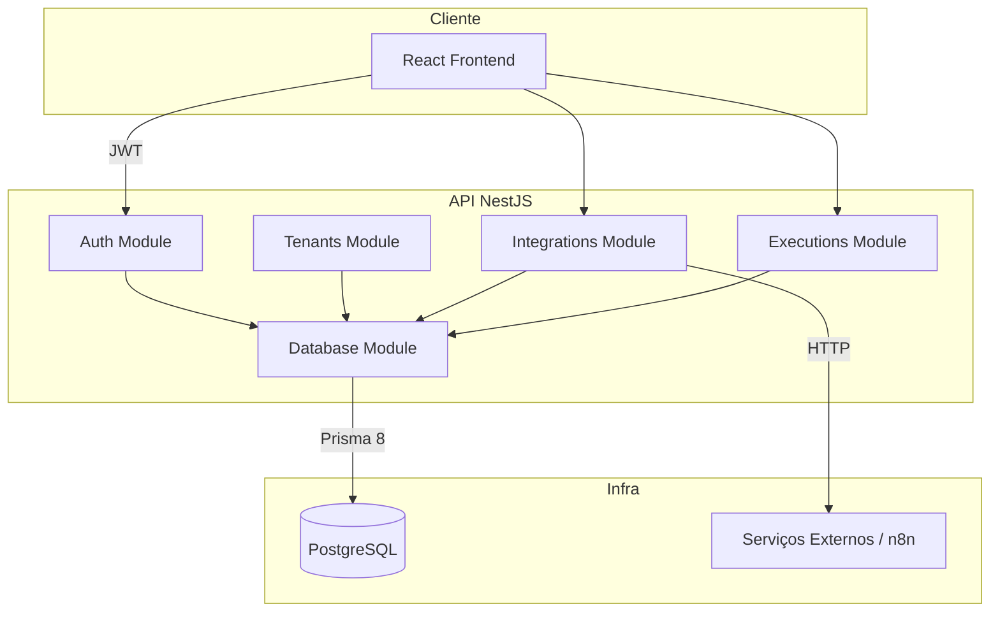
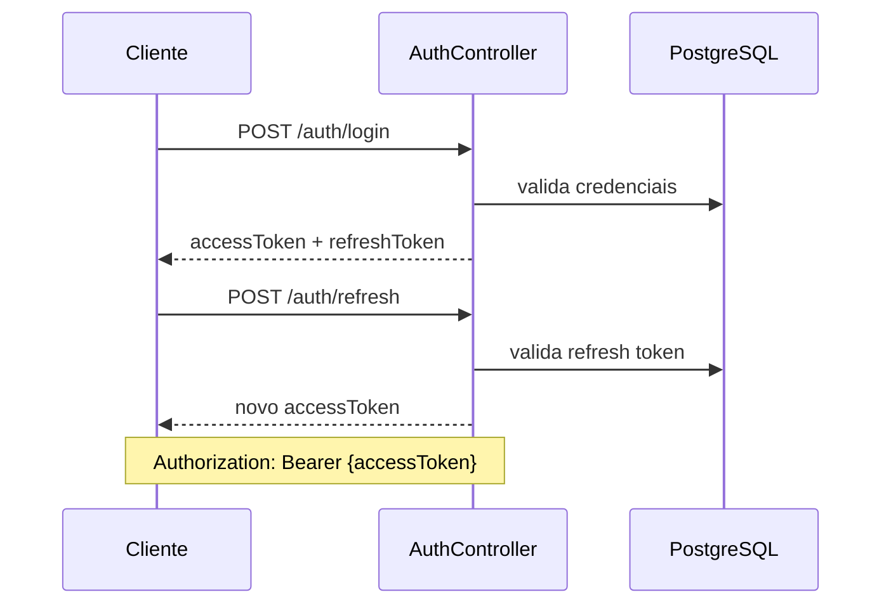

# 3. Arquitetura

[← Índice](./README.md)

## 3.1 Diagrama de contexto



## 3.2 Módulos NestJS

```
src/
├── auth/           # login, refresh, JWT strategy, guards
├── tenants/        # bootstrap de tenant + admin
├── integrations/   # CRUD + trigger
├── executions/     # listagem e detalhe
├── database/       # DatabaseModule — wrapper de db (Prisma 8)
├── prisma/         # contract.prisma, db.ts, seed.ts (não é módulo Nest)
└── common/         # decorators, filters, guards
    ├── decorators/ # @CurrentUser(), @Roles()
    └── guards/     # JwtAuthGuard, RolesGuard
```

## 3.3 Multi-tenancy — estratégia

Tenant ID no JWT + filtro explícito em todas as queries no **service**.

```typescript
const integration = await db.orm.Integration
  .where({ id, tenantId: user.tenantId })
  .first();
if (!integration) throw new NotFoundException();
```

Execuções: validar tenant via relação com `Integration` (tabela não tem `tenantId`).

**Proibido:** retornar recurso de outro tenant (404, não 403).

Prisma 8: `nexus-backend/.cursor/skills/prisma-8/SKILL.md`.

## 3.4 Fluxo de autenticação


