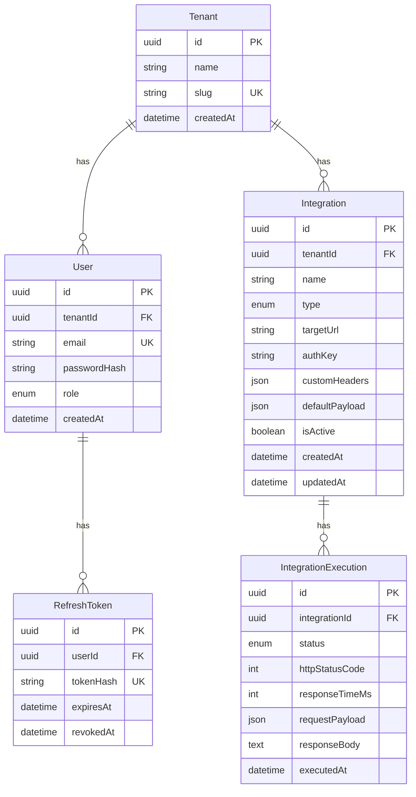

# 4. Modelo de dados

[← Índice](./README.md)

## 4.1 Diagrama ER



## 4.2 Modelo de domínio (referência PSL)

> **Implementação:** `nexus-backend/src/prisma/contract.prisma`. Sintaxe e tipos: skill Prisma 8 (`nexus-backend/.agents/skills/prisma-8/references/contract.md`). Após editar: `npm run contract:emit`. Mudanças versionadas: `migration plan` + `db migrate`.

Bloco abaixo descreve **entidades, campos e relações** do domínio Commandix (PSL de referência). Tipos simplificados (`String`, `DateTime`, `@updatedAt`) para leitura — o contract Prisma 8 real usa os tipos de domínio (`Uuid`, `TimestamptzString`, `temporal.updatedAtString()`); ver a skill. O `onDelete: Cascade` abaixo, porém, **não** é simplificação — reflete a decisão "DELETE integração → hard delete + cascade em execuções" (`AGENTS.md`).

```prisma
enum Role {
  ADMIN
  VIEWER
}

enum IntegrationType {
  WEBHOOK
  REST_API
  N8N
}

enum ExecutionStatus {
  SUCCESS
  FAILURE
}

model Tenant {
  id           String        @id @default(uuid())
  name         String
  slug         String        @unique
  createdAt    DateTime      @default(now())
  users        User[]
  integrations Integration[]
}

model User {
  id            String         @id @default(uuid())
  tenantId      String
  tenant        Tenant         @relation(fields: [tenantId], references: [id])
  email         String         @unique
  passwordHash  String
  role          Role           @default(VIEWER)
  createdAt     DateTime       @default(now())
  refreshTokens RefreshToken[]

  @@index([tenantId])
}

model Integration {
  id             String                  @id @default(uuid())
  tenantId       String
  tenant         Tenant                  @relation(fields: [tenantId], references: [id])
  name           String
  type           IntegrationType
  targetUrl      String
  authKey        String?
  customHeaders  Json?
  defaultPayload Json?
  isActive       Boolean                 @default(true)
  createdAt      DateTime                @default(now())
  updatedAt      DateTime                @updatedAt
  executions     IntegrationExecution[]

  @@index([tenantId, updatedAt])
}

model IntegrationExecution {
  id              String          @id @default(uuid())
  integrationId   String
  integration     Integration     @relation(fields: [integrationId], references: [id], onDelete: Cascade)
  status          ExecutionStatus
  httpStatusCode  Int?
  responseTimeMs  Int
  requestPayload  Json?
  responseBody    String?
  executedAt      DateTime        @default(now())

  @@index([integrationId, executedAt])
}

model RefreshToken {
  id        String    @id @default(uuid())
  userId    String
  user      User      @relation(fields: [userId], references: [id])
  tokenHash String    @unique
  expiresAt DateTime
  revokedAt DateTime?

  @@index([userId])
}
```

## 4.3 Definição das tabelas

> Campos persistidos no PostgreSQL. A API expõe DTOs derivados — ver [Contrato da API](./05-api.md).

### Tenant

| Campo | Tipo | Obrigatório | Notas |
|-------|------|-------------|-------|
| `id` | UUID | sim (PK) | Gerado automaticamente |
| `name` | string | sim | Nome descritivo (sem UK) |
| `slug` | string | sim (UK) | Identificador URL-friendly |
| `createdAt` | datetime | sim | Default: now |

### User

| Campo | Tipo | Obrigatório | Notas |
|-------|------|-------------|-------|
| `id` | UUID | sim (PK) | Gerado automaticamente |
| `tenantId` | UUID | sim (FK) | Referência a `Tenant` |
| `email` | string | sim (UK) | Único globalmente |
| `passwordHash` | string | sim | bcrypt; **nunca expor na API** |
| `role` | enum | sim | `ADMIN` \| `VIEWER` (default: `VIEWER`) |
| `createdAt` | datetime | sim | Default: now |

### Integration

| Campo | Tipo | Obrigatório | Notas |
|-------|------|-------------|-------|
| `id` | UUID | sim (PK) | Gerado automaticamente |
| `tenantId` | UUID | sim (FK) | Referência a `Tenant` |
| `name` | string | sim | |
| `type` | enum | sim | `WEBHOOK` \| `REST_API` \| `N8N` |
| `targetUrl` | string | sim | URL de destino |
| `authKey` | string | não | At-rest: **texto plano** (decisão de PoC, justificada no [`readme.md`](../../readme.md) § Decisões técnicas); **mascarada na API** |
| `customHeaders` | JSON | não | Objeto chave-valor |
| `defaultPayload` | JSON | não | Payload padrão para disparos |
| `isActive` | boolean | sim | Default: `true` |
| `createdAt` | datetime | sim | Default: now |
| `updatedAt` | datetime | sim | Atualizado automaticamente |

### IntegrationExecution

| Campo | Tipo | Obrigatório | Notas |
|-------|------|-------------|-------|
| `id` | UUID | sim (PK) | Gerado automaticamente |
| `integrationId` | UUID | sim (FK) | Referência a `Integration` |
| `status` | enum | sim | `SUCCESS` \| `FAILURE` — ver critério abaixo |
| `httpStatusCode` | int | não | Código HTTP da resposta externa (`null` se timeout/erro de rede) |
| `responseTimeMs` | int | sim | Tempo de resposta em ms |
| `requestPayload` | JSON | não | Payload enviado ao serviço externo |
| `responseBody` | text | não | Corpo da resposta externa; **máx. 10 240 bytes UTF-8** na persistência ([05-api §5.4](./05-api.md#truncamento-de-responsebody)) |
| `executedAt` | datetime | sim | Default: now |

**Critério `SUCCESS` / `FAILURE`:** se a API da integração retornar sucesso (HTTP 2xx), `SUCCESS`; senão, `FAILURE`. Não interpretar o body — apenas o status HTTP (ou ausência de resposta).

### RefreshToken

| Campo | Tipo | Obrigatório | Notas |
|-------|------|-------------|-------|
| `id` | UUID | sim (PK) | Gerado automaticamente |
| `userId` | UUID | sim (FK) | Referência a `User` |
| `tokenHash` | string | sim (UK) | Hash do refresh token; único (lookup direto em login/refresh/logout); **nunca expor na API** |
| `expiresAt` | datetime | sim | |
| `revokedAt` | datetime | não | Preenchido no logout **deste** refresh token (dispositivo atual) |

## 4.4 Seed

Implementado em `nexus-backend/src/prisma/seed.ts` (idempotente). Senha padrão: `Admin123!` (ver [`readme.md`](../../readme.md)).

Entrypoint Docker **sempre** executa seed após migrate. A idempotência é **por tenant**: cada slug é verificado individualmente e só o que falta é criado ([08-docker](./08-docker.md) §8.5).

O `VIEWER` abaixo é **dado demo** inserido pelo seed — não há API de convite/criação de usuários ([02-escopo §2.1](./02-escopo-funcional.md)).

Dois tenants, para o isolamento multi-tenant ser verificável logo após `docker compose up`:

| Tenant | Users | Integrações | Execuções |
|--------|-------|-------------|-----------|
| `Acme Corp` (slug `acme`) | `admin@acme.com` (ADMIN), `viewer@acme.com` (VIEWER) | `Echo Webhook` (`WEBHOOK`, ativa), `CRM Sync` (`REST_API`, **inativa**), `n8n Demo Flow` (`N8N`, ativa) | 10 (5 / 3 / 2) |
| `Globex Industries` (slug `globex`) | `admin@globex.com` (ADMIN), `viewer@globex.com` (VIEWER) | `Order Webhook` (`WEBHOOK`, ativa), `Billing API` (`REST_API`, ativa), `n8n WhatsApp Alerts` (`N8N`, **inativa**) | 10 (5 / 3 / 2) |

Senha de todos os usuários: `Admin123!`.

Escolhas dos dados demo:

- Os três valores de `IntegrationType` aparecem em cada tenant, e **cada tenant tem exatamente uma integração inativa** — exercita a rejeição `400` do trigger em integração inativa.
- As 20 execuções misturam `SUCCESS` e `FAILURE`, incluindo dois casos de erro de rede (`httpStatusCode: null`, `responseTimeMs` no teto de 30 s) — cobre o filtro por status e a coluna de código HTTP vazia no detalhe.
- `executedAt` é gravado como deslocamento em horas a partir do momento do seed (1 h a 143 h atrás), então o histórico continua "recente" a cada banco novo e os filtros de data têm dados dentro e fora de qualquer janela curta.
