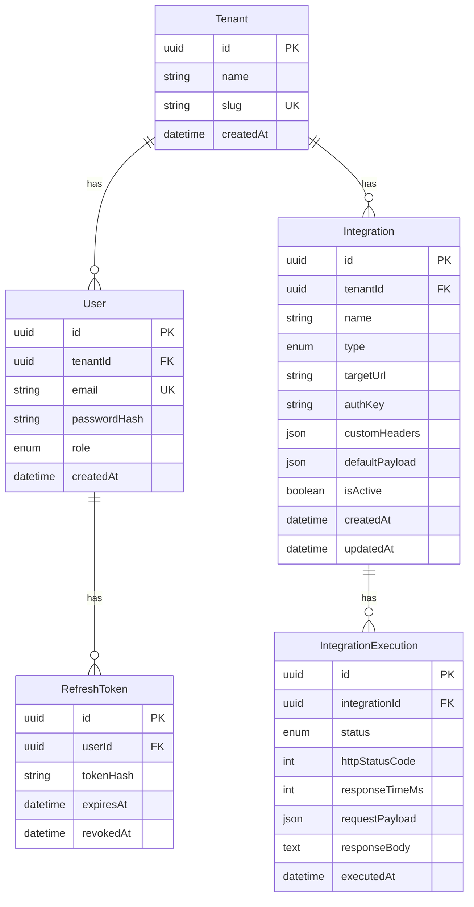

# 4. Modelo de dados

[← Índice](./README.md)

## 4.1 Diagrama ER



## 4.2 Modelo de domínio (referência PSL)

> **Implementação:** `nexus-backend/src/prisma/contract.prisma`. Sintaxe e tipos: skill Prisma 8 (`nexus-backend/.cursor/skills/prisma-8/references/contract.md`). Após editar: `npm run contract:emit`. Mudanças versionadas: `migration plan` + `db migrate`.

Bloco abaixo descreve **entidades, campos e relações** do domínio Commandix (PSL de referência):

```prisma
enum Role {
  ADMIN
  VIEWER
}

enum IntegrationType {
  WEBHOOK
  REST_API
  N8N
}

enum ExecutionStatus {
  SUCCESS
  FAILURE
}

model Tenant {
  id           String        @id @default(uuid())
  name         String
  slug         String        @unique
  createdAt    DateTime      @default(now())
  users        User[]
  integrations Integration[]
}

model User {
  id            String         @id @default(uuid())
  tenantId      String
  tenant        Tenant         @relation(fields: [tenantId], references: [id])
  email         String         @unique
  passwordHash  String
  role          Role           @default(VIEWER)
  createdAt     DateTime       @default(now())
  refreshTokens RefreshToken[]

  @@index([tenantId])
}

model Integration {
  id             String                  @id @default(uuid())
  tenantId       String
  tenant         Tenant                  @relation(fields: [tenantId], references: [id])
  name           String
  type           IntegrationType
  targetUrl      String
  authKey        String?
  customHeaders  Json?
  defaultPayload Json?
  isActive       Boolean                 @default(true)
  createdAt      DateTime                @default(now())
  updatedAt      DateTime                @updatedAt
  executions     IntegrationExecution[]

  @@index([tenantId])
}

model IntegrationExecution {
  id              String          @id @default(uuid())
  integrationId   String
  integration     Integration     @relation(fields: [integrationId], references: [id])
  status          ExecutionStatus
  httpStatusCode  Int?
  responseTimeMs  Int
  requestPayload  Json?
  responseBody    String?
  executedAt      DateTime        @default(now())

  @@index([integrationId, executedAt])
  @@index([status])
}

model RefreshToken {
  id        String    @id @default(uuid())
  userId    String
  user      User      @relation(fields: [userId], references: [id])
  tokenHash String
  expiresAt DateTime
  revokedAt DateTime?

  @@index([userId])
}
```

## 4.3 Definição das tabelas

> Campos persistidos no PostgreSQL. A API expõe DTOs derivados — ver [Contrato da API](./05-api.md).

### Tenant

| Campo | Tipo | Obrigatório | Notas |
|-------|------|-------------|-------|
| `id` | UUID | sim (PK) | Gerado automaticamente |
| `name` | string | sim | Nome descritivo (sem UK) |
| `slug` | string | sim (UK) | Identificador URL-friendly |
| `createdAt` | datetime | sim | Default: now |

### User

| Campo | Tipo | Obrigatório | Notas |
|-------|------|-------------|-------|
| `id` | UUID | sim (PK) | Gerado automaticamente |
| `tenantId` | UUID | sim (FK) | Referência a `Tenant` |
| `email` | string | sim (UK) | Único globalmente |
| `passwordHash` | string | sim | bcrypt; **nunca expor na API** |
| `role` | enum | sim | `ADMIN` \| `VIEWER` (default: `VIEWER`) |
| `createdAt` | datetime | sim | Default: now |

### Integration

| Campo | Tipo | Obrigatório | Notas |
|-------|------|-------------|-------|
| `id` | UUID | sim (PK) | Gerado automaticamente |
| `tenantId` | UUID | sim (FK) | Referência a `Tenant` |
| `name` | string | sim | |
| `type` | enum | sim | `WEBHOOK` \| `REST_API` \| `N8N` |
| `targetUrl` | string | sim | URL de destino |
| `authKey` | string | não | Armazenada criptografada ou em texto; **mascarada na API** |
| `customHeaders` | JSON | não | Objeto chave-valor |
| `defaultPayload` | JSON | não | Payload padrão para disparos |
| `isActive` | boolean | sim | Default: `true` |
| `createdAt` | datetime | sim | Default: now |
| `updatedAt` | datetime | sim | Atualizado automaticamente |

### IntegrationExecution

| Campo | Tipo | Obrigatório | Notas |
|-------|------|-------------|-------|
| `id` | UUID | sim (PK) | Gerado automaticamente |
| `integrationId` | UUID | sim (FK) | Referência a `Integration` |
| `status` | enum | sim | `SUCCESS` \| `FAILURE` — ver critério abaixo |
| `httpStatusCode` | int | não | Código HTTP da resposta externa (`null` se timeout/erro de rede) |
**Critério `SUCCESS` / `FAILURE`:** se a API da integração retornar sucesso (HTTP 2xx), `SUCCESS`; senão, `FAILURE`. Não interpretar o body — apenas o status HTTP (ou ausência de resposta).
| `responseTimeMs` | int | sim | Tempo de resposta em ms |
| `requestPayload` | JSON | não | Payload enviado ao serviço externo |
| `responseBody` | text | não | Corpo da resposta (truncar se necessário) |
| `executedAt` | datetime | sim | Default: now |

### RefreshToken

| Campo | Tipo | Obrigatório | Notas |
|-------|------|-------------|-------|
| `id` | UUID | sim (PK) | Gerado automaticamente |
| `userId` | UUID | sim (FK) | Referência a `User` |
| `tokenHash` | string | sim | Hash do refresh token; **nunca expor na API** |
| `expiresAt` | datetime | sim | |
| `revokedAt` | datetime | não | Preenchido no logout |

## 4.4 Seed sugerido

Implementado em `nexus-backend/src/prisma/seed.ts` (idempotente). Senha padrão: `Admin123!` (ver [`readme.md`](../../readme.md)).

Entrypoint Docker **sempre** executa seed após migrate; pula inserção se tenant `acme` já existir ([08-docker](./08-docker.md) §8.5).

| Entidade | Dados |
|----------|-------|
| Tenant | `Acme Corp` (slug: `acme`) |
| User Admin | `admin@acme.com` / `Admin123!` |
| User Viewer | `viewer@acme.com` / `Admin123!` |
| Integration | 1 webhook (`Echo Webhook`, tipo `WEBHOOK`) |
